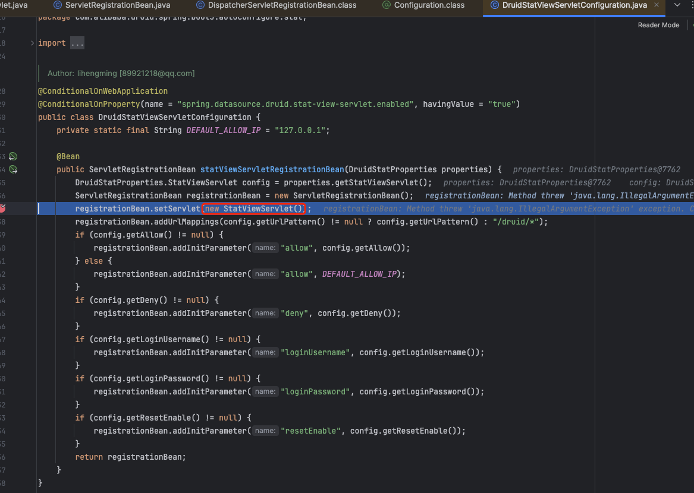
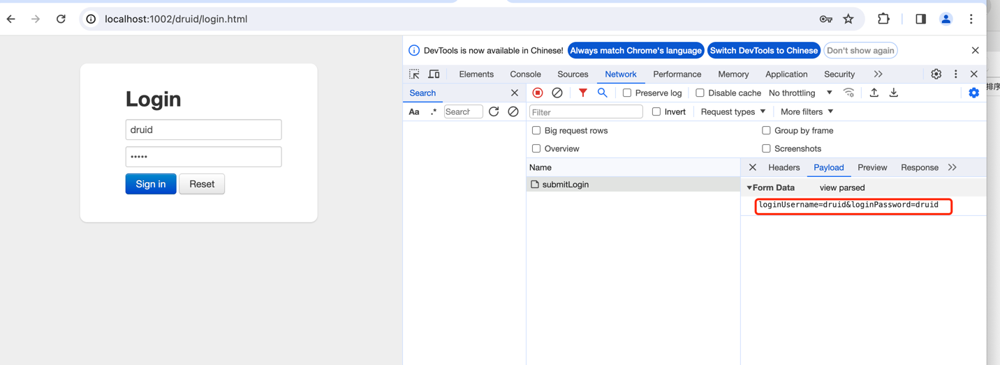
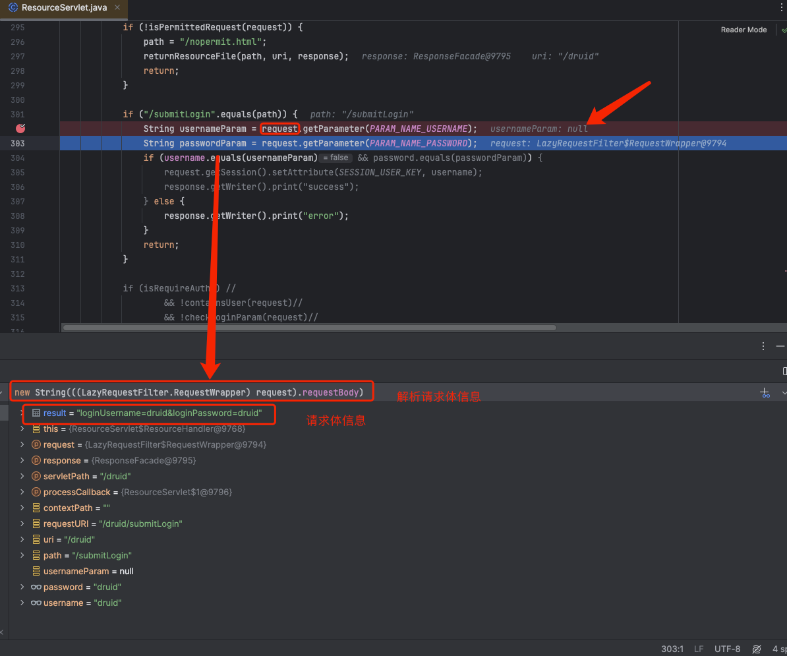
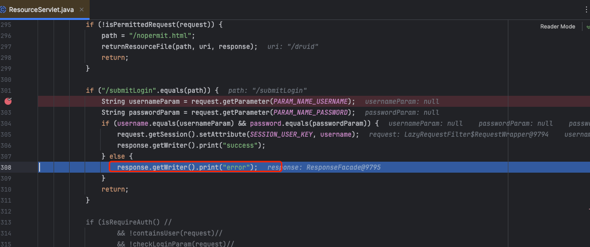
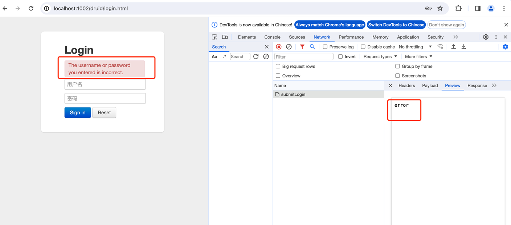
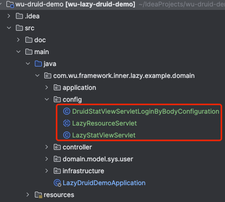
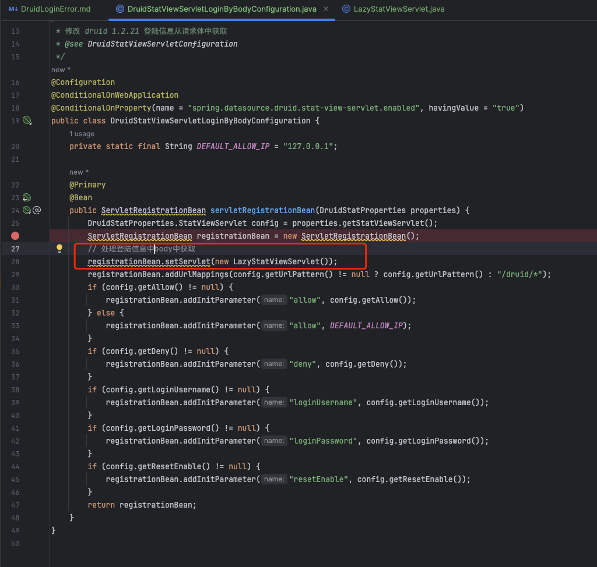
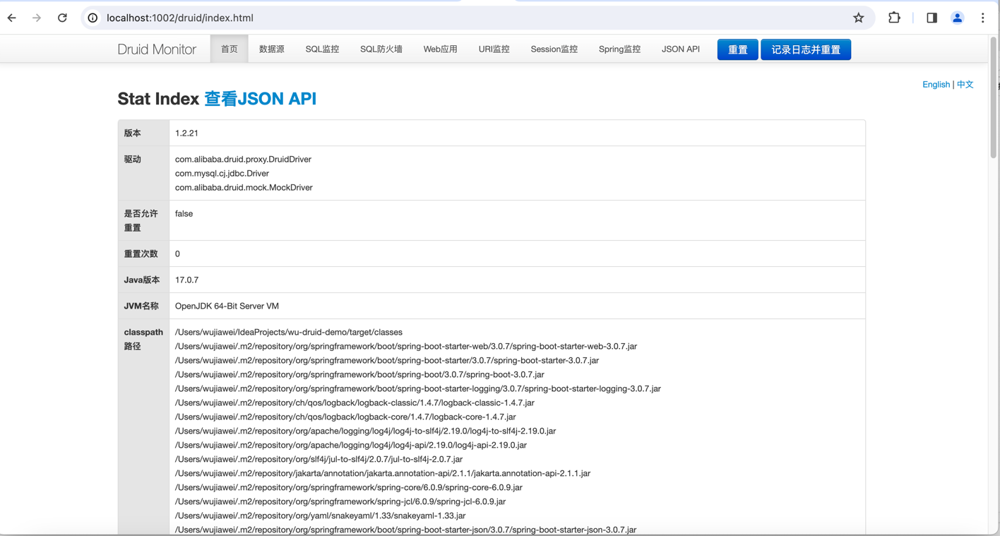
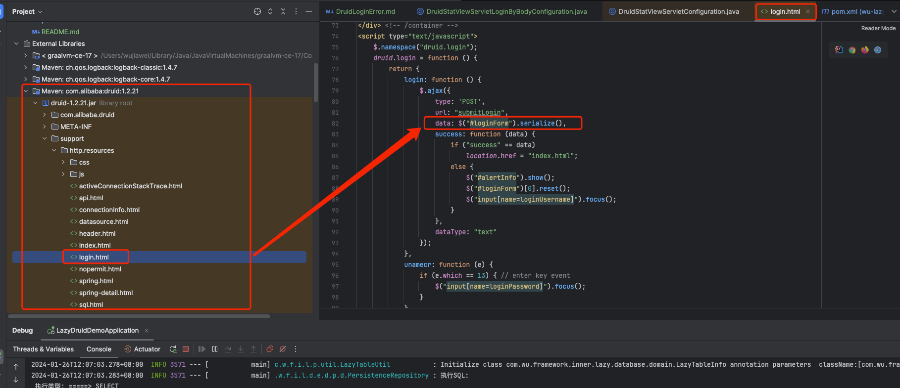

### Druid 登陆异常

#### 问题描述：页面登陆将请求参数放到请求体中导致无法通过request.getParameter 方式
    服务加载流程 通过 DruidStatViewServletConfiguration 中方法 statViewServletRegistrationBean 初始化StatViewServlet
    通过 com.alibaba.druid.support.jakarta.ResourceServlet中的内部类ResourceHandler 解析tomcat拦截数据


页面请求

请求命中


返回错误数据

页面展示 The username or password you entered is incorrect.



#### 处理方案
##### 处理一：后端处理druid登陆账号密码通过请求体获取
    后端添加这三个类

1. LazyResourceServlet 重写tomcat HttpServlet 新增两个方法获取当前请求体数据然后通过请求体中获取账号、密码
```java
    /**
     * body中的数据类型 loginUsername=druid&loginPassword=druid
     *
     * @return body 中的参数属性
     */
    public static String getParamsFromBody(String paramsKey) {
        return getRequestParamFromBody().get(paramsKey);
    }

    /**
     * 从body中解析出请求参数
     *
     * @return body中的请求参数
     */
    public static Map<String, String> getRequestParamFromBody() {
        // DynamicLazyHttpBodyContextHolder 在 wu-framework-web 中 1.2.0以后的版本都支持当前上下文获取请求中的body
        
        byte[] requestBodyBytes = DynamicLazyHttpBodyContextHolder.peek();
        // loginUsername=druid&loginPassword=druid
        String requestBody = new String(requestBodyBytes);
        Map<String, String> paramMap = new HashMap<>();

        for (String paramKeyValue : requestBody.split("&")) {
            String[] keyValue = paramKeyValue.split("=");
            if (keyValue.length != 2) {
                continue;
            }
            paramMap.put(keyValue[0], keyValue[1]);
        }
        return paramMap;
    }
```

    原先代码中通过 request.getParameter(PARAM_NAME_USERNAME) 替换成getParamsFromBody(PARAM_NAME_USERNAME);

2. LazyStatViewServlet 重写实现 LazyResourceServlet
通过构造器初始化LazyResourceServlet

3. DruidStatViewServletLoginByBodyConfiguration 初始化 LazyStatViewServlet


#### 登陆效果



处理二：前端处理将数据放到请求参数处理（暂时不做演示）
